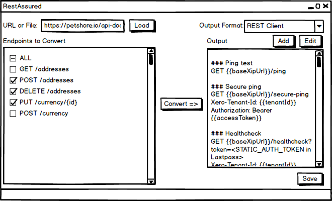

# RestAssured: A tool to convert OpenAPI specs to REST Queries

RestAssured is a tool to convert endpoints defined in OpenAPI documents to queries that can be imported into a range of REST query tools, such as REST Client and Bruno.

The input OpenAPI document is specified and loaded by controls at the top-left. The user is able to select the endpoints to be converted on the left main panel. The Convert button performs the conversion and the output is displayed on the main right panel. The format of the output is chosen by using the drop-down control located at the top right. The Output Format is template based, and templates can be added or modified. The output can be saved to file.
